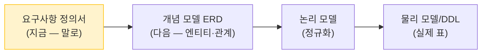

# 요구사항 정의서 — 도서관 대출 관리 시스템

> 토픽 6-2(데이터베이스 설계) 관통 예제. CP60(요구사항)→CP61(ERD)→CP62(정규화)→CP63(DDL)→CP64(인덱스·검증) 까지 *하나의 예제*로 이어진다.
> 이 문서는 설계의 첫 산출물 — "무엇을 만들 것인가"를 말로 정리한 것이다(아직 표·ERD 아님).

## 1. 프로젝트 개요

작은 동네 도서관의 **도서 대출 관리 시스템**을 만든다. 회원이 책을 빌리고 반납하는 과정을 기록·관리한다.

## 2. 기능적 요구사항 (무엇을 할 수 있어야 하나)

| 번호 | 기능 | 설명 |
|------|------|------|
| FR-1 | 회원 관리 | 회원을 등록·조회·수정한다. |
| FR-2 | 도서 관리 | 도서를 등록·검색한다(제목·저자·출판사로). |
| FR-3 | 저자 정보 | 도서의 저자를 관리한다. **한 책에 저자가 여러 명일 수 있고, 한 저자가 여러 책을 쓸 수 있다.** |
| FR-4 | 대출 | 회원이 책을 빌린다. 대출일·반납예정일을 기록한다. |
| FR-5 | 반납 | 빌린 책을 반납한다. 반납일을 기록한다. |
| FR-6 | 연체 관리 | 반납예정일이 지났는데 안 돌아온 대출을 찾는다. |
| FR-7 | 이력 조회 | 회원별 대출 이력, 도서별 대출 현황을 조회한다. |

## 3. 데이터 요구사항 (무엇을 저장해야 하나)

- **회원**: 누구인지(이름), 연락처(이메일·전화), 언제 가입했는지.
- **도서**: 제목, 출판사, 출판일, ISBN, 분류(카테고리).
- **저자**: 이름. (도서와 다대다 관계)
- **대출**: 누가(회원) 어떤 책을 언제 빌렸고, 언제까지 반납해야 하며, 실제로 언제 반납했는지.
- **같은 책이 여러 권**일 수 있다(인기 도서는 사본 3권 등). 어느 *한 권*이 대출 중인지 구분해야 한다.

## 4. 제약조건 (규칙)

| 번호 | 제약조건 |
|------|----------|
| C-1 | 회원의 **이메일은 중복될 수 없다**(회원 식별·연락용). |
| C-2 | 한 회원은 **동시에 최대 5권**까지 빌릴 수 있다. |
| C-3 | 대출 기간은 **14일**이다(반납예정일 = 대출일 + 14일). |
| C-4 | **한 권(사본)은 같은 시점에 한 명에게만** 대출된다. |
| C-5 | 반납하지 않은 책은 다시 대출할 수 없다. |
| C-6 | 도서의 ISBN, 회원의 이메일처럼 **유일해야 하는 값**이 있다. |

## 5. 이 산출물의 위치

> 다음 단계에서 이 요구사항을 *엔티티와 관계*(ERD)로 옮긴다. 그러려면 먼저 "용어와 데이터 항목"을 또렷이 정의해야 한다 → [데이터 사전](02-data-dictionary.md).
