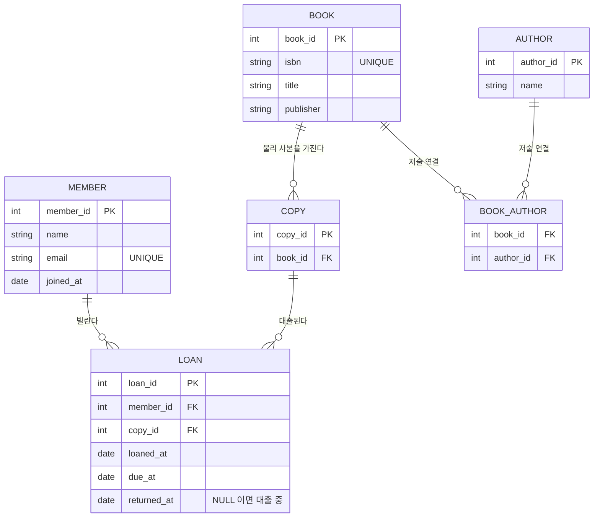
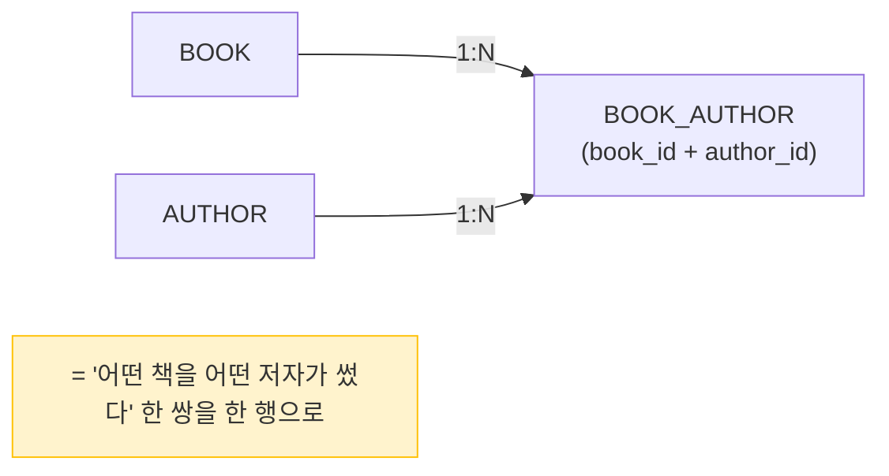

# 개념 모델 ERD — 도서관 대출 관리 시스템

> 설계 셋째 산출물(개념적 모델링). [요구사항 정의서](01-requirements.md)·[데이터 사전](02-data-dictionary.md)를 바탕으로
> **엔티티와 관계**를 그림으로 옮긴다. 실제 도구는 ERDCloud 권장 — 아래는 같은 내용을 mermaid 로 표현.

## 1. 엔티티 도출

요구사항·데이터 사전의 *핵심 명사*에서 엔티티를 뽑았다.

| 엔티티 | 의미 | 분류 |
|--------|------|------|
| MEMBER (회원) | 책을 빌리는 사람 | 기본 |
| BOOK (도서) | 책 한 종류(제목·ISBN 단위) | 기본 |
| AUTHOR (저자) | 책을 쓴 사람 | 기본 |
| COPY (사본) | 도서의 물리적 한 권(실제 대출 대상) | 중심(도서에 의존) |
| LOAN (대출) | 회원이 사본을 빌린 *사건* | 행위(트랜잭션) |
| BOOK_AUTHOR (저술) | 도서-저자 M:N 을 푸는 연결 엔티티 | 연결 |

> **분류**: *기본*(혼자 존재) · *중심*(다른 것에 의존) · *행위*(사건/거래). LOAN 은 "빌리는 행위"라 행위 엔티티.

## 2. ERD (개념 모델)

## 3. 관계 정의 (유형 · 카디널리티 · 필수성)

| 관계 | 유형 | 읽는 법 | 필수성 |
|------|------|---------|--------|
| MEMBER — LOAN | 1 : N | 회원 1명은 대출 0~N건 / 대출 1건은 회원 정확히 1명 | 대출엔 회원 필수 |
| COPY — LOAN | 1 : N | 사본 1권은 (시간차로) 대출 0~N건 / 대출 1건은 사본 정확히 1권 | 대출엔 사본 필수 |
| BOOK — COPY | 1 : N | 도서 1종은 사본 1~N권 / 사본 1권은 도서 정확히 1종 | 사본엔 도서 필수 |
| BOOK — AUTHOR | **N : M** | 책 1권에 저자 여러 명 / 저자 1명이 책 여러 권 | (연결 엔티티로 해소) |

까마귀발(crow's foot) 표기 요약: `||`(정확히 1) · `o{`(0 또는 다수) · `|{`(1 또는 다수).

## 4. M:N 은 연결 엔티티로 푼다 (핵심)

도서 ↔ 저자는 **다대다(N:M)**. 관계형 DB는 N:M 을 *직접* 표현하지 못해서, 그 사이에 **연결(중간) 엔티티** `BOOK_AUTHOR` 를 넣어 *1:N + 1:N* 으로 푼다.

> 6-1 HR 의 JOIN 에서 봤던 "연결 테이블" 이 바로 이거다. N:M 이 보이면 *연결 엔티티* 를 떠올리는 게 설계의 기본 반사신경.

## 5. ERD 품질 검토 (자가 점검)

- [x] 요구사항의 기능이 ERD로 다 표현되나? (대출/반납 → LOAN, 연체 → due_at/returned_at)
- [x] N:M 이 연결 엔티티로 풀렸나? (BOOK_AUTHOR)
- [x] "도서 vs 사본" 구분이 반영됐나? (BOOK 1:N COPY, 대출은 COPY 에)
- [x] 모든 엔티티에 식별자(PK)가 있나?
- [ ] (다음 단계) 속성을 더 정교히 + 정규화 → [논리 모델](04-logical-normalization.md) 에서

> 이 개념 ERD를 다음 차시에서 **논리 모델(속성 확정 + 정규화)** → **물리 모델(DDL)** 로 구체화한다.
