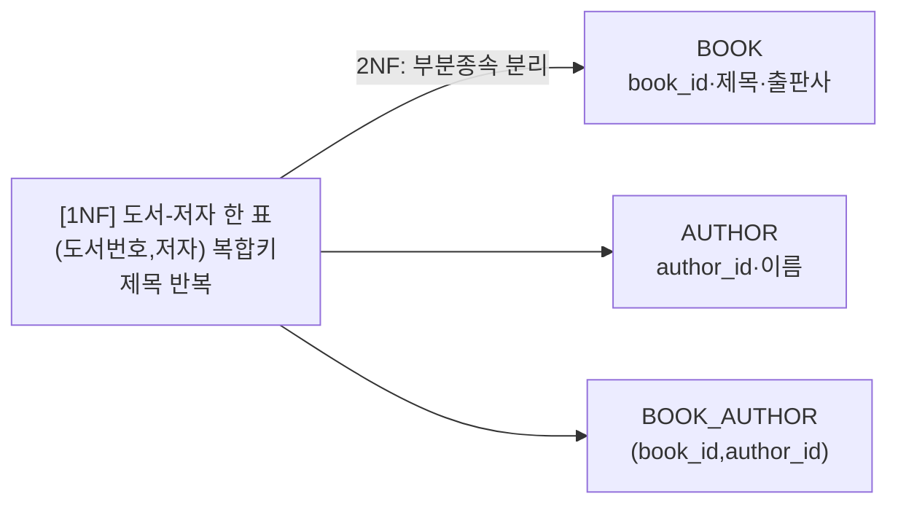
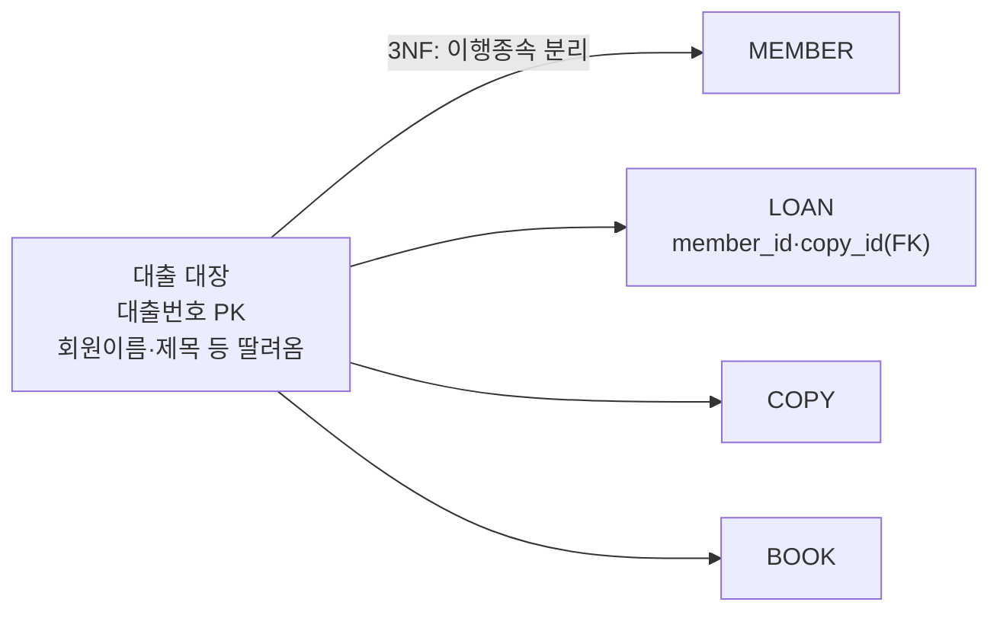

# 논리 모델 + 정규화 — 도서관 대출 관리 시스템

> 설계 넷째 산출물(논리적 모델링). [개념 ERD](03-erd.md)를 받아 **속성을 확정**하고,
> **정규화(1NF→2NF→3NF→BCNF)** 로 중복을 *체계적으로* 제거한다.
> CP61 ERD가 "직관으로 그린 그림"이라면, 정규화는 *그 그림이 옳은지 검증하고 도출하는 규칙*이다 — 둘은 같은 곳에 도착한다.

---

## 1. 속성 설계 (도메인 · NULL 허용)

각 엔티티의 속성에 *도메인(값의 범위·형식)* 과 *NULL 허용 여부* 를 확정한다. (데이터 사전 → 논리 속성으로 정밀화)

### MEMBER (회원)
| 속성 | 도메인 | NULL | 비고 |
|------|--------|------|------|
| member_id | 정수(자동증가) | NOT NULL | PK |
| name | 가변문자 50 | NOT NULL | |
| email | 가변문자 100 | NOT NULL | **UNIQUE**(C-1) — 대체키 |
| phone | 가변문자 20 | NULL | 선택 |
| joined_at | 날짜 | NOT NULL | |

### BOOK (도서)
| 속성 | 도메인 | NULL | 비고 |
|------|--------|------|------|
| book_id | 정수(자동증가) | NOT NULL | PK |
| isbn | 가변문자 20 | NOT NULL | **UNIQUE**(C-6) — 대체키 |
| title | 가변문자 200 | NOT NULL | |
| publisher | 가변문자 100 | NULL | 선택 |

### AUTHOR (저자)
| 속성 | 도메인 | NULL | 비고 |
|------|--------|------|------|
| author_id | 정수(자동증가) | NOT NULL | PK |
| name | 가변문자 50 | NOT NULL | |

### COPY (사본)
| 속성 | 도메인 | NULL | 비고 |
|------|--------|------|------|
| copy_id | 정수(자동증가) | NOT NULL | PK |
| book_id | 정수 | NOT NULL | FK → BOOK |
| location | 가변문자 50 | NULL | 서가 위치 |

### LOAN (대출)
| 속성 | 도메인 | NULL | 비고 |
|------|--------|------|------|
| loan_id | 정수(자동증가) | NOT NULL | PK |
| member_id | 정수 | NOT NULL | FK → MEMBER |
| copy_id | 정수 | NOT NULL | FK → COPY |
| loaned_at | 날짜 | NOT NULL | |
| due_at | 날짜 | NOT NULL | = loaned_at + 14 (C-3) |
| returned_at | 날짜 | **NULL** | NULL이면 *대출 중* |

### BOOK_AUTHOR (저술 — 연결 엔티티)
| 속성 | 도메인 | NULL | 비고 |
|------|--------|------|------|
| book_id | 정수 | NOT NULL | FK → BOOK, 복합 PK 일부 |
| author_id | 정수 | NOT NULL | FK → AUTHOR, 복합 PK 일부 |

> **NULL의 의미를 설계로 쓴다**: `returned_at IS NULL` = "아직 안 낸 책"(=대출 중). NULL 허용 여부는 *업무 규칙*이다 — 아무 데나 NULL을 허용하면 정합성이 깨진다.

---

## 2. 식별자 설계 (후보키 · 기본키 · 대체키)

- **후보키(candidate key)**: 행을 유일하게 식별할 수 있는 열(집합). 한 엔티티에 여럿일 수 있다.
- **기본키(primary key, PK)**: 후보키 중 *대표로 선정*한 하나. NULL 불가, 변하지 않아야 함.
- **대체키(alternate key)**: 후보키인데 PK로 *안 뽑힌* 것 → UNIQUE 제약으로 관리.

| 엔티티 | 후보키 | 기본키(선정) | 대체키(UNIQUE) |
|--------|--------|--------------|----------------|
| MEMBER | {member_id}, {email} | **member_id** | email |
| BOOK | {book_id}, {isbn} | **book_id** | isbn |
| AUTHOR | {author_id} | **author_id** | — |
| COPY | {copy_id} | **copy_id** | — |
| LOAN | {loan_id} | **loan_id** | — |
| BOOK_AUTHOR | {book_id, author_id} | **(book_id, author_id)** 복합 | — |

> **왜 email/isbn을 PK로 안 쓰나?** 둘 다 유일하지만 *바뀔 수 있고*(이메일 변경) *길다*. PK는 가능하면 *짧고 불변인 인공키(대리키, surrogate key)* = 자동증가 정수를 쓰고, 자연키(email·isbn)는 *대체키(UNIQUE)* 로 둔다. 이게 실무 표준.

---

## 3. 정규화 — 나쁜 표를 단계적으로 고친다

정규화의 동기를 보려면, *모든 걸 한 표에 쑤셔 넣은* 나쁜 설계에서 출발한다.

### 출발: 비정규 "대출 대장" (한 표에 전부)

| 대출번호 | 회원번호 | 회원이름 | 회원이메일 | 사본번호 | 도서번호 | 제목 | 출판사 | 저자들 | 대출일 | 반납예정일 |
|---------|---------|---------|-----------|---------|---------|------|--------|--------|--------|-----------|
| 1 | 10 | 김철수 | kim@ex.com | 100 | 1 | 클린코드 | 인사이트 | **마틴, 펑** | 06-01 | 06-15 |
| 2 | 10 | 김철수 | kim@ex.com | 205 | 7 | 해리포터 | 문학사 | 롤링 | 06-02 | 06-16 |

**무엇이 문제인가**
- *저자들* 칸에 여러 값(`마틴, 펑`) → 검색·수정 지옥 (**1NF 위반**)
- 김철수의 이메일이 *대출마다 반복* → 이메일 바뀌면 여러 행 수정, 누락 시 불일치 (**중복**)
- 회원이 책을 한 권도 안 빌리면 회원 정보를 어디에도 못 적음 (**삽입 이상**)

### 제1정규형(1NF) — 모든 값은 *원자값*, 반복 그룹 제거

`저자들`을 *한 행에 한 값* 으로 편다(저자별로 행 분리). 그러면 키가 (대출번호, 저자) 로 바뀐다.

| 대출번호 | … | 도서번호 | 제목 | 저자 |
|---------|---|---------|------|------|
| 1 | … | 1 | 클린코드 | 마틴 |
| 1 | … | 1 | 클린코드 | 펑 |

> 이제 `저자` 칸이 원자값이라 "마틴이 쓴 책" 검색이 쉬워졌다. 하지만 *제목이 두 번* 적혔다 — 다음 단계의 먹잇감.

### 제2정규형(2NF) — *부분 함수 종속* 제거 (복합키의 일부에만 의존하는 속성 분리)

복합키 (도서번호, 저자) 에서:
- `제목·출판사` 는 **도서번호** 에만 의존 (저자와 무관) → 부분 종속
- `저자이름` 은 **저자번호** 에만 의존 → 부분 종속

각자 제 엔티티로 분리한다 → **BOOK** / **AUTHOR** / **BOOK_AUTHOR**(연결).



> CP61에서 *직관으로* 그린 N:M → 연결 엔티티가, 여기선 *2NF 규칙의 결과* 로 똑같이 나온다. 정규화는 ERD를 *검증*한다.

### 제3정규형(3NF) — *이행적 함수 종속* 제거 (키가 아닌 속성에 의존하는 속성 분리)

대출 대장에서:
- `대출번호 → 회원번호 → 회원이름·이메일` : 회원이름은 PK(대출번호)에 *직접*이 아니라 회원번호를 *거쳐* 의존 → **이행 종속**
- `사본번호 → 도서번호 → 제목·출판사` : 마찬가지

이행적으로 딸려오는 속성을 제 엔티티로 분리 → **MEMBER** / **LOAN** / **COPY** / **BOOK**.



### BCNF — 모든 결정자가 후보키 (3NF의 강화판)

3NF를 만족해도, *후보키가 아닌* 속성이 다른 속성을 결정하면 BCNF 위반이다. 도서관 모델은 결정자(member_id·book_id·…)가 모두 후보키라 **이미 BCNF를 만족**한다. (실무 대부분은 3NF≈BCNF에서 멈춘다.)

### 도착점 = CP61 ERD 그대로

정규화를 끝내면 나오는 표 집합:

```
MEMBER · BOOK · AUTHOR · COPY · LOAN · BOOK_AUTHOR
```

→ **CP61에서 그린 ERD와 정확히 일치한다.** 중복 0, 이상(anomaly) 0.

---

## 4. 정규화 단계 요약표

| 단계 | 제거 대상 | 한 줄 정의 | 도서관에서 한 일 |
|------|-----------|-----------|-----------------|
| 1NF | 다중값·반복그룹 | 모든 값은 원자값 | `저자들` → 저자별 행 |
| 2NF | 부분 함수 종속 | 복합키 *전체* 에 의존 | 제목/저자이름 분리 → BOOK·AUTHOR·BOOK_AUTHOR |
| 3NF | 이행 함수 종속 | 키 아닌 속성 거쳐 의존 금지 | 회원·도서 정보 분리 → MEMBER·COPY·BOOK |
| BCNF | 후보키 아닌 결정자 | 모든 결정자가 후보키 | (이미 만족) |

---

## 5. 정규화와 성능의 균형

정규화는 *중복 제거·정합성* 을 얻지만, 표가 잘게 쪼개져 **조회 시 JOIN이 늘어난다**.

- 원칙: **설계는 일단 정규화(3NF)** 로. 중복은 정합성의 적.
- 예외: 조회가 압도적으로 많고 JOIN 비용이 병목이면, *의도적으로* 일부 중복을 허용하는 **역정규화(denormalization)** 를 *나중에* 검토한다. (성능 측정 → 필요할 때만)
- 순서가 중요: "처음부터 빠를 것 같아서" 역정규화하지 않는다. *정규화 먼저, 역정규화는 근거를 갖고 나중에.*

> 인덱스·역정규화의 구체적 기법은 다음 물리 설계 차시(인덱스/검증/역정규화)에서 다룬다.

---

## 6. Spring(JPA) 연결 — 이 논리 모델이 곧 엔티티 설계도

- 정규화로 분리된 표 하나 = JPA `@Entity` 하나 (MEMBER → `Member`, LOAN → `Loan` …).
- 기본키(인공키) = `@Id @GeneratedValue`, 대체키(email·isbn UNIQUE) = `@Column(unique = true)`.
- 정규화로 *분리한* 엔티티들은 JPA에서 **연관관계로 다시 이어진다** — `LOAN.member_id`(FK) → `@ManyToOne Member`.
- N:M 연결 엔티티 BOOK_AUTHOR = `@ManyToMany` 를 피하고 *직접 `@Entity`* 로 (CP61에서 예고).
- 정규화↔성능 균형 = JPA에서 **N+1 문제·Fetch Join** 으로 다시 만난다(쪼갠 대가를 조회에서 치름).

> 즉, *이 논리 모델표가 그대로 JPA 엔티티·연관관계 설계도* 다. 6-3에서 SprintLog에 이 절차를 똑같이 적용한다.
